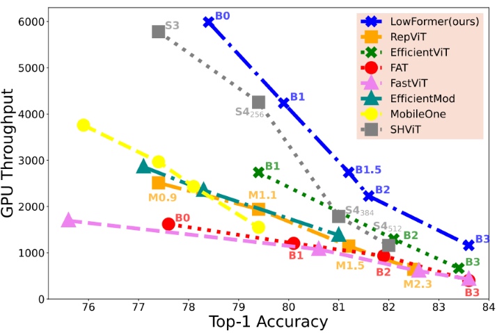
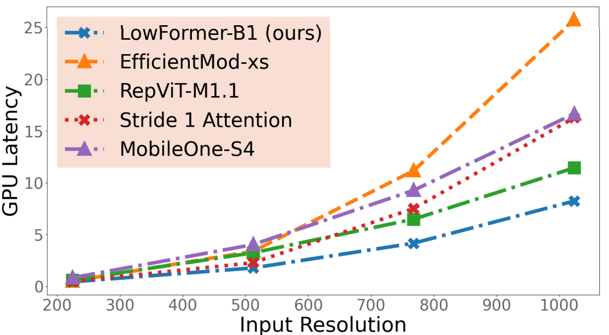

# LowFormer: Hardware Efficient Design for Convolutional Transformer Backbones ([paper](https://www.arxiv.org/pdf/2409.03460))
[](https://opensource.org/licenses/Apache-2.0) [](https://pytorch.org/) [](https://www.arxiv.org/abs/2409.03460)

This is the official repository for ["LowFormer: Hardware Efficient Design for Convolutional Transformer Backbones"](https://www.arxiv.org/pdf/2409.03460), which was accepted at [WACV2025](https://wacv2025.thecvf.com/).

Authors: [Moritz Nottebaum](https://scholar.google.de/citations?user=y7paI7EAAAAJ&hl=de), [Matteo Dunnhofer](https://scholar.google.de/citations?user=GIhkF8UAAAAJ&hl=de&oi=ao) and [Christian Micheloni](https://scholar.google.de/citations?user=Gbnq0F8AAAAJ&hl=de&oi=ao)

This repository contains code to train and test our LowFormer model, as well as to benchmark its speed. We also feature the base implementation of several backbones published in the recent years, as well as means to benchmark their execution time.


GPU Throughput and Top1-accuracy comparison (left), as well as effect of input resolution on GPU latency (right).
<p align="middle" >
    
  
   
</p>


## Setup

### Install
To run the code follow these steps.

Set up a conda environment and activate it:
```
conda create --name lowformer
conda activate lowformer
```
Install requirements from requirements.txt:
```
pip install -r requirements.txt
```
### Dataset Setup
You have to download [ImageNet-1K](https://www.image-net.org/) and set the variable `data_dir` in `configs/cls/imagenet/default.yaml` for training and testing on ImageNet-1K.

If you want to evaluate and benchmark the latency of throughput you have to set `--path` in `eval_cls_model.py` in the argument parser at the beginning of the `main()` method or during execution of `eval_cls_model.py`.


## Just use the pretrained Model

The script below is an example on how to just use the pretrained model from this repository:
``` 
import torch
from get_model import get_lowformer

config_path = "configs/cls/imagenet/b1.yaml"
checkpoint_path = ".exp/cls/imagenet/b1/checkpoint/evalmodel.pt"

model = get_lowformer(config_path, checkpoint_path)

inp = torch.randn(5,3,224,224)
out = model(inp) # -> [5,1000]

```


## Training


### Run Training Single-GPU
To run on one GPU, specify the GPU-id with `CUDA_VISIBLE_DEVICES` and execute the following command:

```
CUDA_VISIBLE_DEVICES=0 torchrun --nnodes 1 
--nproc_per_node=1  --rdzv-endpoint localhost:29411 \
train_cls_model.py configs/cls/imagenet/b1_alternative.yaml  \
    --data_provider.image_size "[128,160,192,224]"   \
    --run_config.eval_image_size "[224]" \
    --path .exp/cls/imagenet/b1_alternative/ 
```


### Run Training Multi-GPU
To run on 8 GPUs, just run the following command:

```
CUDA_VISIBLE_DEVICES=0,1,2,3,4,5,6,7 torchrun --nnodes 1 
--nproc_per_node=8  --rdzv-endpoint localhost:29411 \
train_cls_model.py configs/cls/imagenet/b1_alternative.yaml  \
    --data_provider.image_size "[128,160,192,224]"   \
    --run_config.eval_image_size "[224]" \
    --path .exp/cls/imagenet/b1_alternative/
```

>Caveat: The total batch size in the config file is multiplied with the GPU instances and as well is the learning rate in the config file!

### Gradient Accumulation
In order to simulate a bigger batch size, there is a parameter in the configs called `bsizemult`, which is normally set to 1. The learning rate is also multiplied with it, as `bsizemult` increases the effective batch size.


## Testing
For testing and speed analysis `eval_cls_model.py` can be used. 
We also feature a vast library of popular backbone architectures. We adapted their code such that they can be converted to torchscript and onnx for speed measurement. For a list of all featured architectures look at `featured_models.txt`, containing one example for each architecture (architecture: fastvit, model: fastvit_t8 ; architecture: mobileone, model: mobileones3 ).

### Evaluation on ImageNet-1K
To evaluate a model given in `configs/cls/imagenet`, just run the following command:

```
python eval_cls_model.py b1 --image_size 224 --batch_size 100  --gpu 6
```


### Throughput Measurement
The following command runs the model LowFormer-B1 (from configs/cls/imagenet) for 400 iterations, with a batch size of 200, it uses torchscript optimization (optit) and has an input resolution of 224x224 (throughput measurement):

```
python eval_cls_model.py b1 --image_size 224 --batch_size 200 --testrun --iterations 400 --gpu 6 --optit
```

### Latency Measurement
You can benchmark latency with a torchscript converted version of the model and utilize torch inference optimization (see [here](https://pytorch.org/docs/stable/generated/torch.jit.optimize_for_inference.html) for more information)
```
python eval_cls_model.py b1 --image_size 224 --batch_size 1 --testrun --latency --optit --iterations 4000 --gpu 6 --optit --jobs 1
```

#### ONNX Benchmark

You can also convert LowFormer-B1 to onnx and benchmark its latency (the onnx conversion is already implemented in `eval_cls_model.py`):

```
python eval_cls_model.py b1 --image_size 224 --batch_size 1 --testrun --latency --onnxrun --iterations 4000 --gpu 6 --optit --jobs 1
```

> Because of torchscript conversion the checkpoint cannot completely be loaded, as the `ClsHeadTorchScript` class is used instead of `ClsHead` in `lowformer/models/lowformer/cls.py`. This can however be fixed by adapting the checkpoint if needed.

#### Multiple Processes

It is also possible to measure latency with `n` parallel processes executing the model by setting the `--jobs` variable:

```
python eval_cls_model.py b1 --image_size 224 --batch_size 1 --testrun --latency --optit --iterations 4000 --gpu 6 --optit --jobs 4
```


### Speed Measurement of popular Backbone Models
When you append the argument `--other` followed by a string, you can run a lot of other backbones. Most of these backbones do not load their weights, so this functionality is purely for speed measurement (but could be extended for evaluation). The following command benchmarks [MobileOne-S1](https://openaccess.thecvf.com/content/CVPR2023/papers/Vasu_MobileOne_An_Improved_One_Millisecond_Mobile_Backbone_CVPR_2023_paper.pdf) [1]:

```
python eval_cls_model.py b1 --image_size 224 --batch_size 1 --testrun --latency --onnxrun --iterations 4000 --gpu 6 --optit --jobs 1 --other mobileones1
```

> Please see below in acknowledgements for a link to the repository of MobileOne publication.

## Model Zoo

| Model              | GPU Throughput | GPU Latency | params | MACs | top1 acc | 
| :---------------- | :------: | ----: | ----: | ----: | ----: | 
| LowFormer-B0      |   5988   | 0.3   | 14.1  | 944   | 78.4  | 
| LowFormer-B1      |   4237   | 0.43  | 17.9  | 1410  | 79.9  | 
| LowFormer-B1.5    |  2739    | 0.66  | 33.9  | 2573  |  81.2 | 
| LowFormer-B3      |  1162    | 1.55  | 57.1  | 6098  | 83.6  | 

All [Checkpoints](https://www.dropbox.com/scl/fo/xtgv7fpae4vzpdu2ajsz1/ALuycdfNrmZ44yYCeE6ILPA?rlkey=2gfcrsryep8hnipw831ufymms&dl=0) are downloadable and already present in the required folder structure. Simply put the downloaded folder structure into the main directory.

## Train your own models

### Easy

To train a custom architecure simply adapt the `lowformer_cls_b1()` method in `lowformer/models/lowformer/cls.py`. Replace the method call `lowformer_backbone_b1(**kwargs)` (returns a pytorch model) with your own model. Then simply copy the `b1.yaml` config file and name it however you want.
Then run the training command specified under section "Training", but adapting the config file path.

### Advanced
You need to change the variable `name: b1` in a config file to your model name and adapt `model_dict` in  method `create_cls_model` in `lowformer/cls_model_zoo.py` accordingly, then add own methods in `lowformer/models/lowformer/cls.py` and `lowformer/models/lowformer/backbone.py` for your model. 

If you want to add layers of your own you should add them in `lowformer/models/nn/ops.py`.

## Acknowledgements

We thank the contributors of the [codebase](https://github.com/mit-han-lab/efficientvit) and the  [paper](https://openaccess.thecvf.com/content/ICCV2023/papers/Cai_EfficientViT_Lightweight_Multi-Scale_Attention_for_High-Resolution_Dense_Prediction_ICCV_2023_paper.pdf) "EfficientViT: Multi-Scale Linear Attention for High-Resolution Dense Prediction" [2], which was used as a base for this repository.
> Caveat: There are two EfficientViT papers, the other one is called "Efficientvit: Memory efficient vision transformer with cascaded group attention"

We also thank the contributors of the openly available code of the many backbones architectures we feature in this repository. 
Here is a list to all their repositories:

[FastViT](https://github.com/apple/ml-fastvit),
[Efficientmodulation](https://github.com/ma-xu/EfficientMod),
[MobileViG](https://github.com/SLDGroup/MobileViG),
[iFormer](https://github.com/sail-sg/iFormer),
[MobileOne](https://github.com/apple/ml-mobileone),
[FFNet](https://github.com/ysj9909/FFNet),
[GhostNetV2](https://github.com/huawei-noah/Efficient-AI-Backbones/tree/master/ghostnetv2_pytorch),
[EfficientViT](https://github.com/microsoft/Cream/tree/main/EfficientViT),
[EdgeViT](https://github.com/saic-fi/edgevit),
[PVTv2](https://github.com/whai362/PVT),
[FAT](https://github.com/qhfan/FAT),
[EfficientFormer](https://github.com/snap-research/EfficientFormer),
[SHViT](https://github.com/ysj9909/SHViT),
[RepViT](https://github.com/THU-MIG/RepViT)


## Citation
We hope you find our work useful. If you would like to acknowledge it in your project, please use the following citation:
```
@misc{nottebaum2024lowformerhardwareefficientdesign,
      title={LowFormer: Hardware Efficient Design for Convolutional Transformer Backbones}, 
      author={Moritz Nottebaum and Matteo Dunnhofer and Christian Micheloni},
      year={2024},
      eprint={2409.03460},
      archivePrefix={arXiv},
      primaryClass={cs.CV},
      url={https://arxiv.org/abs/2409.03460}, 
}
```
Papers mentioned in this README:

[1] Vasu, Pavan Kumar Anasosalu, et al. "Mobileone: An improved one millisecond mobile backbone." Proceedings of the IEEE/CVF conference on computer vision and pattern recognition. 2023.

[2] Cai, Han, et al. "Efficientvit: Lightweight multi-scale attention for high-resolution dense prediction." Proceedings of the IEEE/CVF International Conference on Computer Vision. 2023.

